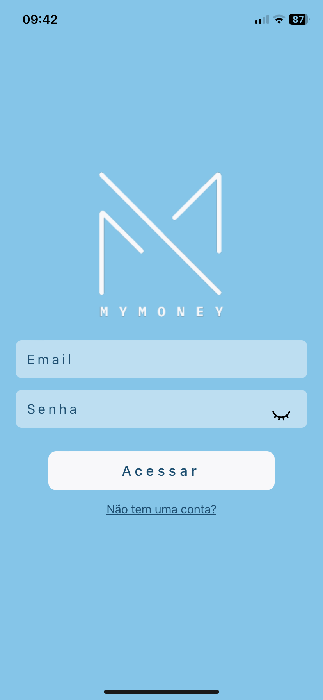
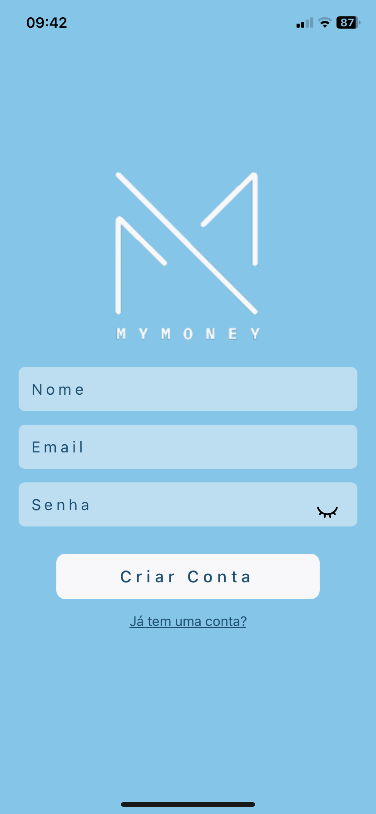
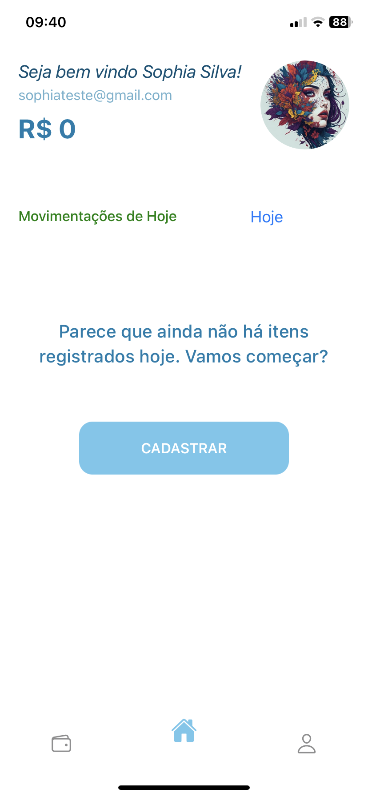
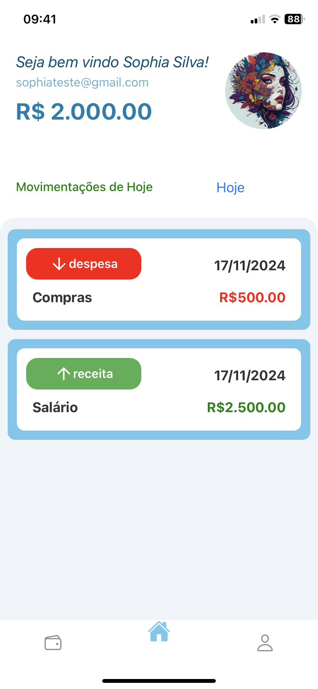
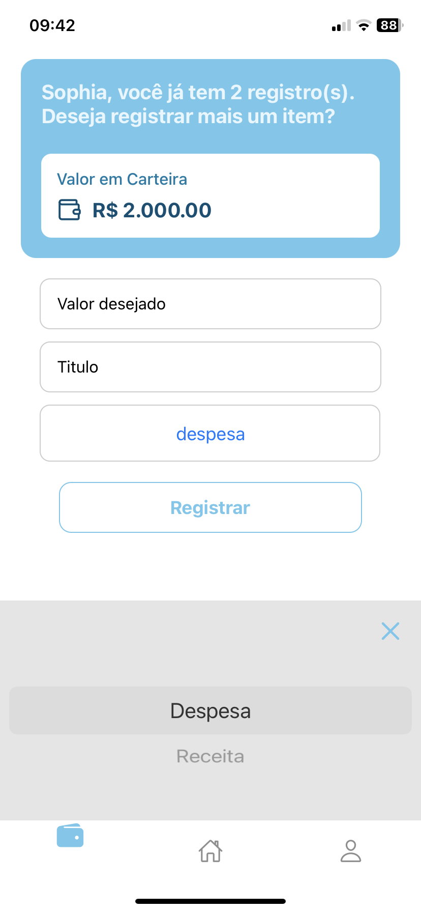
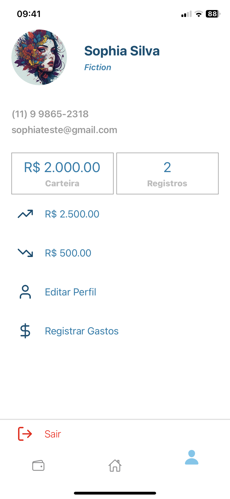

**myMoney** é um aplicativo de registro de despesas construído com **React Native**, utilizando **Expo Go**, **Firebase** para login, cadastro de usuários e registros, e **styled-components** para estilização. A navegação entre telas é gerenciada com **React Native Navigation**.

---

## **Funcionalidades**  

O aplicativo possui quatro telas principais:  

### **1. Tela de Autenticação**  
- Inclui as telas de **Login** e **Cadastro**.  
- A navegação entre elas é suave e visualmente agradável, utilizando estados para transições dinâmicas.  

| Tela de Login                              | Tela de Cadastro                          |
|--------------------------------------------|-------------------------------------------|
|  |  |

### **2. Tela Home**  
- Tela principal do aplicativo.  
- Mostra:  
  - Nome do usuário e foto de perfil.  
  - Valor total em conta.  
  - Lista de itens cadastrados (com filtros).  
- **Filtros disponíveis**:  
  - Cadastros do dia atual.  
  - Receitas (entradas de dinheiro).  
  - Despesas (saídas de dinheiro).  
- Itens podem ser excluídos diretamente da lista, mas apenas os registros do dia.  
- **Picker estilizado** para iOS e Android.  

#### **Exemplo de Tela Home:**  

| Sem Itens Cadastrados                              | Com Itens Cadastrados                           |
|----------------------------------------------------|------------------------------------------------|
|  |  |

--- 

### **3. Tela Register**  
- Exibe:  
  - Um card com o valor disponível na carteira.  
  - Número total de itens cadastrados.  
- Contém:  
  - Dois inputs para entrada de dados.  
  - Um picker reutilizado da tela Home (evitando repetição de código).  
- Ao registrar um item:  
  - Ele é salvo no **Firebase Realtime Database**.  
  - Atualiza automaticamente a lista de itens na tela Home, graças ao método **onValue**.
    
**Imagem 4: Tela de Registro de Itens**  

### **4. Tela de Perfil**  
- Exibe as informações do usuário:  
  - Nome, email, foto de perfil, profissão e telefone.  
  - Valores:  
    - Valor total em carteira.  
    - Número total de registros.  
    - Total de ganhos e de gastos.  
- Funcionalidades:  
  - **Editar perfil**:  
    - Permite alterar nome, profissão, telefone e a URL da foto de perfil (funcionalidade futura).  
  - **Registrar gastos**: Redireciona para a tela Register.  
  - **Sair**: Desloga o usuário.  

| Tela de Perfil                                    | Editando o Perfil                              |
|--------------------------------------------------|-----------------------------------------------|
|  |  |

---

## **Contextos**  

Para facilitar a comunicação entre componentes, foram criados dois contextos:  

1. **`authContext`**:  
   - Gerencia e distribui informações do usuário, como nome, email, foto de perfil e saldo em conta.  

2. **`historicContext`**:  
   - Gerencia os itens cadastrados, incluindo:  
     - Lista de itens.  
     - Valor total.  
     - Receita total.  
     - Gasto total.  

---

## **Dependências**  

As principais dependências utilizadas são:  

- **[`lucide-react-native`](https://github.com/lucide-icons/lucide-react-native)**: Para ícones.  
- **[`styled-components`](https://styled-components.com/)**: Para estilização.  
- **[`@react-navigation/native`](https://reactnavigation.org/)**: Para navegação.  
- **[`@react-navigation/bottom-tabs`](https://reactnavigation.org/docs/bottom-tab-navigator/)**: Para navegação em abas.  
- **[`@react-native-picker/picker`](https://github.com/react-native-picker/picker)**: Para criação de pickers.  
- **[`@react-native-async-storage/async-storage`](https://github.com/react-native-async-storage/async-storage)**: Para salvar a sessão do usuário.  

## **Funcionalidades futuras**  
- Upload direto de imagens para o perfil.  
- Gráficos para análise de gastos e receitas.  

---

## **📄 Licença**  
Este projeto está sob a licença **MIT**. Sinta-se à vontade para usá-lo e contribuir!  

